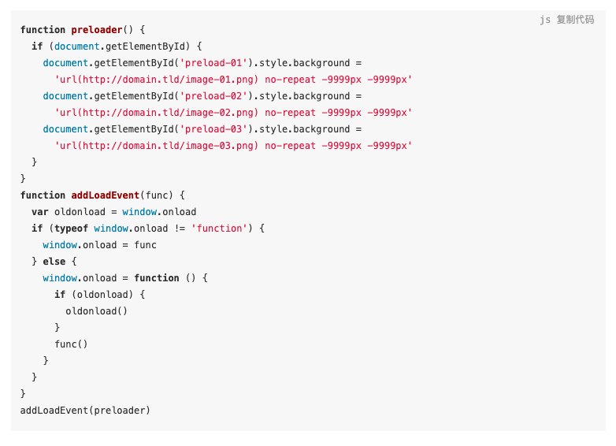
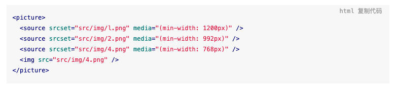

# 如果本地资源里面有一个 10 mb+ 的图片，它又是整个网页的背景图片，你如何优化它，让它不影响网页的渲染速度？

1. 选择合适的图片格式：

    1. JPG
    2. PNG
    3. GIF
    4. WebP：集以上图片格式各家所长，同时还可以减少图片的体积，缺点就是浏览器兼容性问题；

2. 图片压缩：在不影响图片的清晰度的情况下，进行图片压缩

    1. 使用图片压缩工具；
    2. 使用 image-webpack-loader;

3. 图片懒加载：

    1. 把图片请求和渲染放到网页主体内容渲染完成之后；
    2. 将图片拆分成 N 段，然后利用根据当前滚动的高度与图片的高度进行计算，决定懒加载的对应图片片段；

4. 图片预加载：借助 CSS 属性 background  + JavaScript；

    

5. 响应式图片懒加载：

    1. 借助 CSS 媒体查询，根据当前屏幕分辨率来决定当前加载的图片的尺寸；
    2. 借助 HTML 5 的 `<picture>` 和 `<source>` 标签；

6. 渐进式图片 JPEG：

    1. 使用 JPEG 格式的图片（背景是透明的 PNG GG）；
    2. JPEG 图片的保存方式有两种：Baseline JPEG 和 Progressive JPEG；
    3. Baseline JPEG 文件存储的方式是按照从上到下的扫描顺序，把每一行顺序地保存在 JPEG 文件中。当读取这个文件时，数据是按照存储时的顺序，从上到下一行一行地显示出来。
    4. Progressive JPEG 文件包含了多次扫描，这些扫描顺序存储在 JPEG 文件中。打开 JPEG 图片时，会先显示整个图片的模糊轮廓，随着扫描次数增多，图片逐渐变得清晰。