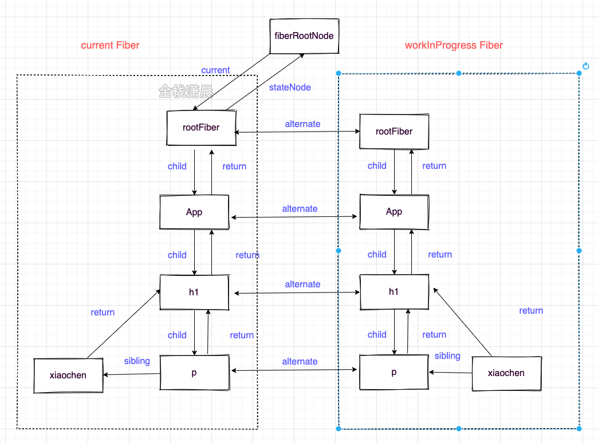
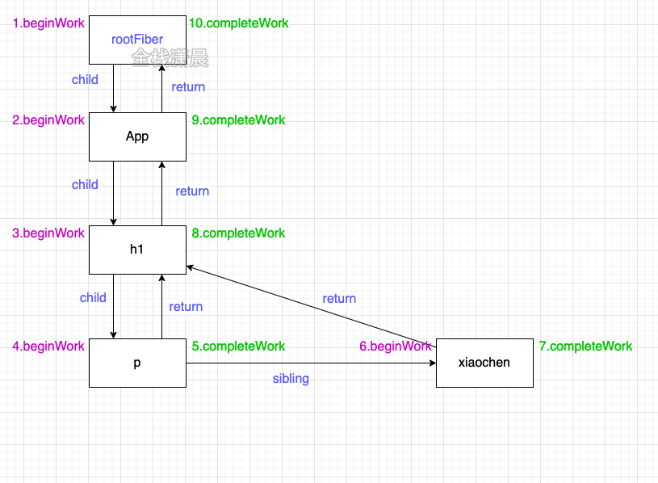
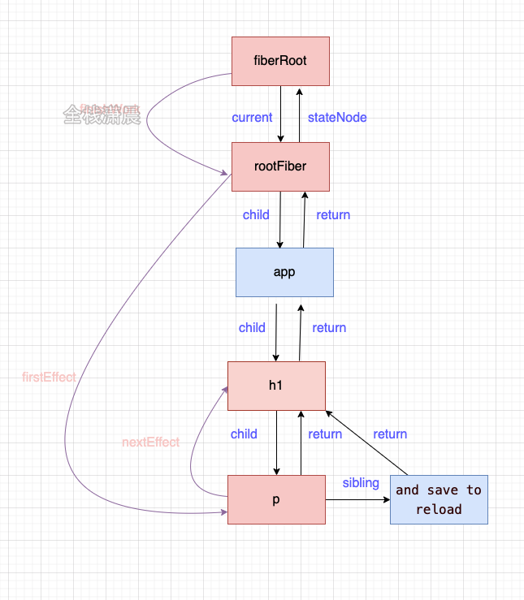
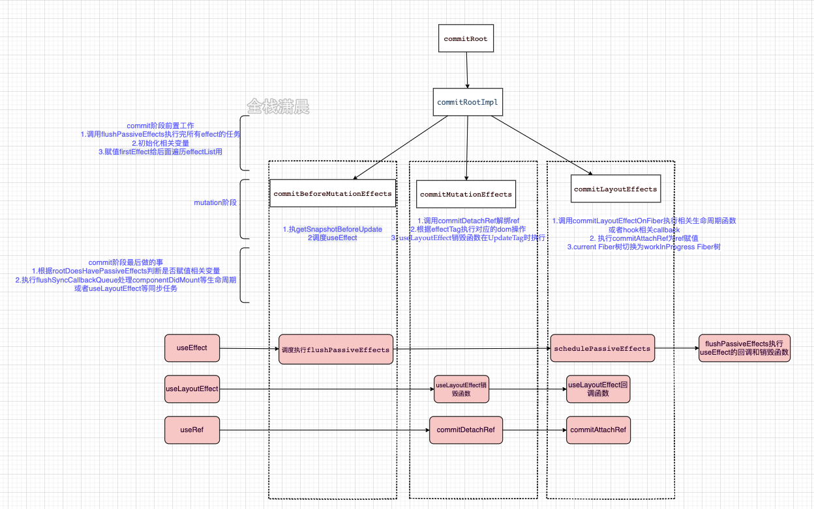

https://xiaochen1024.com/courseware/60b1b2f6cf10a4003b634718/60b1b328cf10a4003b63471b

React 16+ 的核心可以用 `UI = fn(state)` 来表示，但是更详细可以用：

```javascript
const state = reconcile(update)
const UI = commit(state)
```

上面的 fn 可以分为如下各个部分：

* Scheduler（调度器）：排序优先级，让优先级高的任务先进性 reconcile；
* Reconciler（协调器）：找出哪些节点发生了变化，并打上不同的 Flags；
* Renderer（渲染器）：将 Reconciler 中打好标签的节点渲染到视图上。

## Fiber 对象

Fiber 具有两层含义：

* 每一个 element 节点都对应了一个 Fiber 对象，保存了该组件的类型以及 DOM 节点信息等；
* 每一个 Fiber节点保存了本次更新中对应组件改变的状态、要执行 的工作等；

Fiber 的数据结构：

```javascript
function FiberNode(tag, pendingProps, key, mode) {
  // tag 组件的类型
  this.tag = tag;
  
  // key 属性
  this.key = key;
  
  // 对于 FunctionComponent 指函数本身；
  // 对于 ClassComponent 指的是 class；
  // 对于 HostComponent 指的是 DOM 节点的 tagName;
  this.type = null;
  
  // 大部分情况同 type，某些情况不同，比如 FunctionComponent 使用 React.memo 包裹
  this.elementType = null;
  
  // Fiber 对应的真实 DOM 节点
  this.stateNode = null;
  
  // 以下属性用于链接其他 Fiber 节点形成 Fiber 树
  // 指向父 Fiber 节点
  this.return = null;
  // 指向**第一个**子节点
  this.child = null;
  // 指向右边第一个兄弟 Fiber 节点
  this.sibling = null;
  
  this.index = 0;
  
  // 获取真实节点的 DOM 属性
  this.ref = null;
  
  // 动态的工作单元属性，保存本次更新造成的状态改变等相关信息
  this.pendingProps = pendingProps;
  this.memoizedProps= null;
  this.updateQueue = null;
  this.memoizedQueue = null;
  this.dependencies = null;
  
  // 开发模式
  this.mode = mode;
  
  // 保存本次更新会造成的 DOM 操作，比如删除、移动
  this.effectTag = NoEffect;
  this.nextEffect = null;
  this.firstEffect = null;
  this.lastEffect = null;
  
  // 调度优先级相关
  this.expirationTime = NoWork;
  this.childExpirationTime = NoWork;
  
  // 指向该 Fiber 在另一次更新时对应的 Fiber
  // 用于链接新树和旧树：新 -> 旧, 旧 -> 新
  this.alternate = null;
  
  // ...
}
```

## Fiber 双缓存

Fiber 对象上保存了包括这个节点的属性、类型、DOM 等，Fiber 通过 child、sibling、return（指向父节点）来形成 Fiber 树，还保存了更新状态时用于计算 state 的 updateQueue；

updateQueue 是一种链表结构，上面可能存在多个未计算的 update，update 也是一种数据结构，上面包含了更新的树据、优先级等，除了这些之外，还有和副作用有关的信息。

Fiber 双缓存是指存在在内存中，同时存在两颗 Fiber 树 Current Fiber 树 和 WorkInProgress Fiber 树，Current Fiber 树描述了当前呈现的 dom 树，workInProgress Fiber 树是正在更新的 Fiber 树，在 WorkInProgress Fiber 树构建完成之后会将它作为 Current Fiber 树应用到 DOM 上。

在 mount 时（首次渲染），会根据 JSX 对象构建 Fiber 对象，形成 Fiber 树，然后这颗 Fiber 树会作为 Current Fiber 应用到真实 dom 上，在 Update 的时候，会根据状态变更后的 JSX 对象和 Current Fiber 树来做对比形成新的 WorkInProgress Fiber 树，然后 WorkInProgress Fiber 树切换成 Current Fiber 应用到真实 DOM 就达到了更新的目的，这一切都是在内存中发生的，从而减少了对 DOM 耗性能的操作。

```javascript
function App() {
	const [count, setCount] = useState(0);
	return (
		<>
			<h1 onClick={() => setCount(() => count + 1)}>
				<p title={count}>{count}</p> xiaochen
			</h1>
		</>
	);
}
```



## Scheduler

Scheduler 的作用是调度任务，react 15 没有这部分，因此所有任务没有优先级，只能同步执行；

要实现异步可中断的更新，需要浏览器指定一个时间，如果没有时间剩余了就需要暂停任务。requestIdleCallback 是个不错的选择，但是由于它的兼容性和不稳定性，React 17 采用 MessageChannel 来实现。

```javascript
// ReactFiberWorkLoop.old.js
function workLoopConcurrent() {
  while(workInProgress !== null && !shouldYield()) { // shouldYield 判断是否暂停任务
    workInProgress = performUnitOfWork(workInProgress);
  }
}
```

在 Scheduler 中的每个任务的优先级使用过期时间表示的，如果一个任务的过期时间离现在很近，说明它马上就要过期了，优先级很高。如果过期时间很长，那么它的优先级很低，没有过期的任务放在 `timeQueue` 中，过期的任务存放在 `taskQueue` 中，`timeQueue` 和 `taskQueue` 都是小顶堆，所以取出来的都是离现在时间最近的也就是优先级较高的那个任务，然后优先执行它。

## Lane 模型

React 之前的版本用 expirationTime 属性代表优先级，首先该优先级和 IO 不能很多好的搭配工作（IO 的优先级高 CPU 的优先级），现在用 Lane 模型使得优先级更细粒度的划分。

Lane 模型用二进制表示优先级，二进制中的 1 表示位置，同一个二进制数可以有多个相同优先级的位，这就可以表示“批”的概念，而且二进制方便计算。

Lane 模型的优先级机制就是饥饿问题，低优先级的任务如果被高优先级的任务一直打断，到了它的过期时间，他也会变成高优先级。

Lane 的二进制如下，1 的位数越多，优先级则越低：

```javascript
//ReactFiberLane.js
export const NoLanes: Lanes = /*                        */ 0b0000000000000000000000000000000;
export const NoLane: Lane = /*                          */ 0b0000000000000000000000000000000;

export const SyncLane: Lane = /*                        */ 0b0000000000000000000000000000001;
export const SyncBatchedLane: Lane = /*                 */ 0b0000000000000000000000000000010;

export const InputDiscreteHydrationLane: Lane = /*      */ 0b0000000000000000000000000000100;
const InputDiscreteLanes: Lanes = /*                    */ 0b0000000000000000000000000011000;

const InputContinuousHydrationLane: Lane = /*           */ 0b0000000000000000000000000100000;
const InputContinuousLanes: Lanes = /*                  */ 0b0000000000000000000000011000000;

export const DefaultHydrationLane: Lane = /*            */ 0b0000000000000000000000100000000;
export const DefaultLanes: Lanes = /*                   */ 0b0000000000000000000111000000000;

const TransitionHydrationLane: Lane = /*                */ 0b0000000000000000001000000000000;
const TransitionLanes: Lanes = /*                       */ 0b0000000001111111110000000000000;

const RetryLanes: Lanes = /*                            */ 0b0000011110000000000000000000000;

export const SomeRetryLane: Lanes = /*                  */ 0b0000010000000000000000000000000;

export const SelectiveHydrationLane: Lane = /*          */ 0b0000100000000000000000000000000;

const NonIdleLanes = /*                                 */ 0b0000111111111111111111111111111;

export const IdleHydrationLane: Lane = /*               */ 0b0001000000000000000000000000000;
const IdleLanes: Lanes = /*                             */ 0b0110000000000000000000000000000;

export const OffscreenLane: Lane = /*                   */ 0b1000000000000000000000000000000;
```

> `0b000000001100` 以 `0b` 开头的数字串表示二进制。

## Reconciler

Reconciler 发生在 `render` 阶段，render 阶段会分别为节点执行 `beginWork` 和 `completeWork` ，或者计算 state，对比节点差异，为节点赋值相应的 `effectFlags`（对 DOM 节点的增删改）。

简单一句话概括就是，reconciler 会创建或者更新 Fiber 节点：

* 在 mount 阶段，会根据 JSX 生成 Fiber 对象；
* 在 update 阶段，会根据最新的 state 形成的 Fiber 树与 courrent Fiber 树进行对比、构建 workInProgress Fiber 树，这个对比过程就是 Diff 算法。

Diff 算法又分为单节点 Diff 和多节点 Diff：

* 单节点 Diff，主要是比较单个 Fiber 节点的 key / type / props 等来判断节点是否复用还是直接创建新节点；
* 多节点 Diff 则主要是涉及到了节点的增删和节点位置的变化等；

Reconciler 会在变更的 Fiber 节点打上 Flags 标签，在 commit 阶段把这些标签应用到真实的 DOM 上，这些标签代表节点的增删改，如：

```javascript
//ReactFiberFlags.js
export const Placement = /*             */ 0b0000000000010;
export const Update = /*                */ 0b0000000000100;
export const PlacementAndUpdate = /*    */ 0b0000000000110;
export const Deletion = /*              */ 0b0000000001000;
```

React 在 render 阶段会遍历 Fiber 树，遍历算法类似 DFS （深度优先搜索算法）

- 在“捕获”阶段执行 `beginWork`，该函数的主要工作是创建 Fiber 节点，计算 state 和 diff 算法；
- 在“冒泡”阶段执行 `completeWork`，该函数的主要是做一些收尾工作，比如处理节点的 props、形成一条 effectList 的链表，该链表是被标记了更新的节点形成的链表。

深度优先遍历如下图所示，图中的数字是顺序，return 指向父节点：

```javascript
function App() {
  return (
   	<>
      <h1>
        <p>count</p> xiaochen
      </h1>
    </>
  )
}
```



看如下代码：

```javascript
function App() {
  const [count, setCount] = useState(0);
  return (
   	 <>
      <h1
        onClick={() => {
          setCount(() => count + 1);
        }}
      >
        <p title={count}>{count}</p> xiaochen
      </h1>
    </>
  )
}
```

如果 `p` 和 `h1` 节点更新了，则 `effectList` 如下，从 `rootFiber -> h1 -> p`，

> fiberRoot 是整个项目的根节点，只存在一个，而 rootFiber 是应用的根节点，可能存在多个，如 `ReactDOM.render(<App />, document.getElementById('root'))` 创建多个应用节点。



## Renderer

Renderer 是发生在 commit 阶段，commit 阶段遍历 `effectList` 执行对应的 dom 操作或部分声明周期。

commit 阶段发生在 `commitRoot` 函数中，该函数主要遍历 `effectList`，分别用三个函数来处理effectList上的节点：

- commitBeforeMutationEffects；
- commitMutationEffects；
- commitLayoutEffects 。


