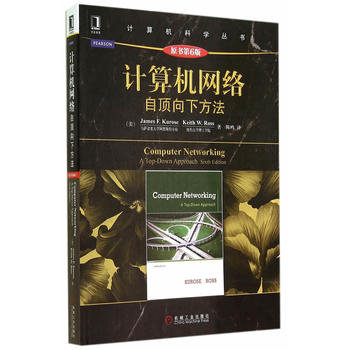
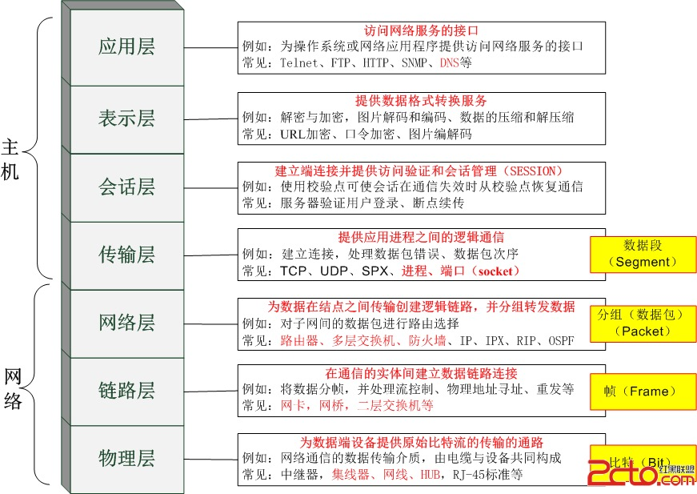

# 🎉 读书笔记系列之《计算机网络》

## 🍺 前言

学习《计算机网络：自顶向下方法》这本书，主要是为了重新了解计算机的网络的发展、历史和概念。大学本科的时候虽然学过，但是毕竟经过了很长时间，都己经忘得差不多了。作为一名 F2E 是离不开互联网的，因此了解网络知识、理解相关原理对于日常的学习和工作都会带来好处（当然包括吹 🐂，哈哈）。写计算机网络系列的读书笔记是想为自己日后的写作迈出第一步。

## OSI

## 🍔 目录：

- [第一章 计算机网络和因特网（互联网）](./chapter_1.md)
- [附件 什么是慢启动？](./chapter_1.md)
