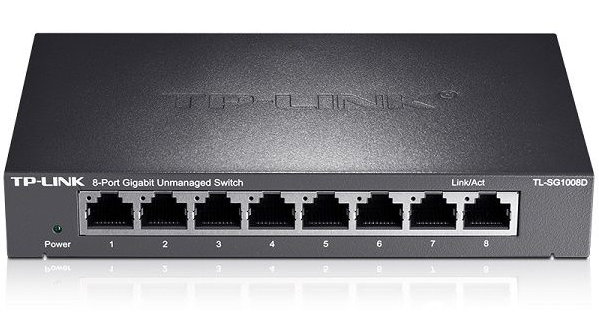

# 第一章 计算机网络和因特网（互联网）

> 不闻不若闻之，闻之不若见之，见之不若知之，知之不若行之 —— 中国谚语

## 1.1 因特网（互联网）

首先我们先从什么是因特网说起，因特网也叫做互联网（书中就称呼如此，实在是别扭，下文中均以互联网代替因特网）。是一种特定的计算机网络，整本书所讨论的也正是**公共互联网**。描述互联网的构成主要有两种方式：

* 从互联网的构成来解释就是互联网是由**硬件**和**软件**构成的；
* 从应用程序的角度解释就是为**分布式应用提供服务**的**联网基础设施，即应用程序的平台**。

具体的构成有主机（也称端系统）、服务器、移动设备、路由器、链路层交换机、调制解调器、基站等等功能复杂的硬件和基础设施。

首先介绍关于互联网描述中的一些概念：

* 端系统：电脑、移动终端（手机）等设备，他们通过**通信链路**和**分组交换机**连到一起；

* 通信链路：是由不同类型的物理媒体组成，如同轴电缆、铜线、光纤和无线电频谱。不同物理媒体的传输速率也不同，链路的传输速率是以**比特/秒**（bit/s or bps）为单位；

* 分组（Packet）：端系统 A 要发送数据到端系统 B 时，发送端系统 A 会将数据进行分段，并在每段上加上首部信息，由此形成的信息包成为分组；

* 分组交换机（Packet Switch）：即从一端入通信链路接收分组，再从另一端出通信链路发送分组的设备。目前比较常见的两种分组交换机是**路由器**和**链路层交换机**。链路层交换机一般用于接入网中（比如数据中心）即为下图：

* 互联网服务提供商（ISP）：端系统通过 ISP 接入互联网。互联网将端系统彼此互联，因此为端系统提供互联接入服务的 ISP 也必须互联；

* 协议（Protocol）：端系统、分组交换机和其他互联网部件均要运行一系列的协议。TCP/IP 协议是互联网中最重要的两个协议。标准对于协议来说是很重要的，主要是用于多人协作。<font style="color: red; font-weight: bold;">协议</font>的定义<font style="color: red; font-weight: bold;">是</font>在两个或多个通信实体之间交换报文格式和次序、以及报文发送或接受一条报文或其他事件所采取的<font style="color: red; font-weight: bold;">动作</font>。**在我个人理解，协议是一套动作的标准规则和流程，遵照标准抹平多人协作时产生的差异，规范协作的内容和流程，以达到统一的**。

* 应用程序编程接口（Application Programming Interface，API）：端系统上的软件请求互联网基础设施向另一端系统上的特定目的的软件**交付数据**的方式。

## 1.2 网络边缘

> 主机 = 端系统

接入网：是指将端系统连接到其边缘路由器的物理链路，**个人理解的边缘路由器为家庭、企业等路由器及其接入方式**；

**家庭接入**方式分为五种：DSL、电缆、FTTH、拨号和卫星。我们主要介绍前三种，其中：

* DSL：
  * 英文名称 Digital Subscriber Line，翻译过来就是**数字用户线**；
  * 通常是通过电话线接入互联网，通过不同编码频率传输不同的数据和电话信号，比如网络下行信道的频段是 50kHZ - 1MHz，上行信道是 4kHz - 50kHz，双向电话信道是 0 - 4kHz；
  * 由于 DSL 的上、下行信道的传输速率是不同的，因此称这种接入为**不对称的**；
  * 范围受限，距离受限；

* 电缆：
  * 通常借助有线电视的基础设施实现互联网的接入；
  * 一般的，接入系统使用了同轴电缆和光纤，因此称这种混合的接入物理媒体成为**混合光纤同轴（Hybrid Fiber Coax，HFC）**；
  * 电缆接入的方式仍然是不对称的，由于它的上行与下行信道的传输速率是不同的；
  * 电缆接入具有一个重要的特征：**共享广播媒体**。共享链路，共享上行和下行的传输速率，共享带宽，这也是为什么现在每个家庭中网络带宽达不到运营商承诺的速率，就是因为多户共享带宽。既然是共享，很难 避免资源抢占或碰撞，因此就需要**分布式多路访问协议**来协调传输和避免碰撞

* 光纤：
  * 英文名称 Fiber To The Home，缩写 FTTH；
  * 最简单的光纤分布网络被叫做直接光纤，从本地中心局到每户家庭都建立一根光纤；
  * 以上仅仅是理想情况，实际上从本地中心局接出的每根光纤所承载的是许多家庭，直到相对接近这些家庭才将该光纤分成每户一根光纤；
  * 根据上述拆分，产生了两种不同的光纤分布结构：主动光纤网络（Active Optical Network，AON）与被动光纤网络（Passive Optical Network，NON）；
  * 光纤接入由于利用光进行数据传输，因此其**上行和下行信道的传输速率很高**，但是越高的速率意味着更多的成本，而且光纤的材质（主要为玻璃）决定了这种物理媒介十分的脆弱。

企业或家庭的接入的方式：以太网和 WIFI，就目前而言，绝大多数的家庭应该具备了 WIFI 能力：

* 以太网：
  * 通常是通过局域网（LAN）将端用户连接到边缘路由器的；
  * 局域网技术千万种，以太网接入是主流；

* WIFI：
  * 可称作无线 LAN；
  * 利用无线电频谱建立传输链路；


**广域网**无线接入：3G、4G 和 LTE。由运营商的基站发送无线电传输分组。

物理媒体：端到端系统之间的数据交换借助的是跨越物理媒体传播的**电磁波或光脉冲**。物理媒体根据其传播时使用的材料分为：引导媒体和非引导媒体。引导媒体意味着电波沿着**固体**媒体前行，比如光缆、同轴电缆等；非引导媒体则是电波在空气或外层空间中进行传播，如无线局域网或数字卫星频道。

## 1.3 网络核心

首先确定“网络核心”的概念，即互联网是由端系统的**分组交换机**与**链路**构成得到网状网络。

OK，既然知道网络核心是由分组交换机与与其相连的链路构成的，那么分组交换机也可以说是网络核心中的核心。

*什么是分组交换机？*

在各种网络应用中，端系统之间交换的是数据被称作**报文（Message）**。从源端系统到目的端系统发送一个报文，是需要将报文进行划分为 N 个小的数据块，这些数据块又被称作**分组**。在源和目的端系统之间，每个分组都是需要通过通信链路和分组交换机进行数据传递的，分组交换机一般较常见的类型有**路由器**和**链路层交换机**。

多数的分组交换机在链路的输入端使用**存储转发传输机制**。从字面上理解，将其划分为**存储、转发、传输**。存储意味着分组交换机在开始向链路输出该分组的第一个比特前，必须先接收整个分组；转发则是确定到达目的端系统路径上的相邻下一个节点的地址和输出链路；传输则是将分组以一定的速率向输出链路发送比特数据。

基于存储转发传输机制可知，在理想情况下（湖绿传播时延，源与目的端系统之间仅有一条链路路径），由于节点之间仅用一条链路相连，因此从源端系统中发送分组仅可以每次发送一个。当分组交换机每次接收一个分组时，是需要将其全部接收完毕后再开始转发（可以与管道中流水相对比），这就产生了一定的时延。

> *假设有 P 个分组（大小为 L bit）经过 N 条链路（传输速率是 R bps）序列的时延有多大？*

```JavaScript
/*
  
  首先每个分组在链路的传输均需要 N * (L / R) 时间
  但是由于分组交换机的存储转发传输机制，每次从源端系统发出的分组（除第一个）
  都比上一个分组发送时间延长 (L / R) 时间，等待上一个分组在第一条链路中全部被传输到第一个分组交换机后
  才能开始传输当前分组。
  
  思路如下：
  
  p = 1 时，Tp = N * (L / R);
  p = 2 时，T1 = N * (L / R); T2 = T1 + (L / R);
  p = 3 时，T1 = N * (L / R); T2 = T1 + (L / R); T3 = T2 + (L / R);
  ...
  ...
  p = n 时，T1 = N * (L / R); T2 = T1 + (L / R); T3 = T2 + (L / R); ... Tn = Tn-1 + (L / R);
  
  因此，这是一等差数列，那么 Tn = T1 + (p-1) * (L / R) =  N * (L / R) + (p-1) * (L / R);

*/
```

## 1.4 分组交换网中的时延、丢包和吞吐量

## 1.5 协议层次及其服务模型

## 1.6 面对攻击的网络

## 1.7 计算机网络和互联网的历史