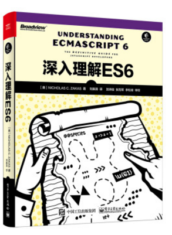

# 🎉 读书笔记系列之《深入理解 ES6》

## 🍺 前言

初步的想法是借助《深入理解 ES6》这本书，系统地对我所了解、使用过的 ES6 的知识点进行扫盲，夯实自己的基础，想在这纷杂、高效的前端环境中利于不败之地（十分担心未来的十年自己是否还有如此激情和学习的热情）。

## 🍔 目录：

* [第一章 块级作用域绑定](./chapter_1.md) 
* [第二章 字符串和正则表达式](./chapter_2.md)
* [第三章 函数](./chapter_3.md)