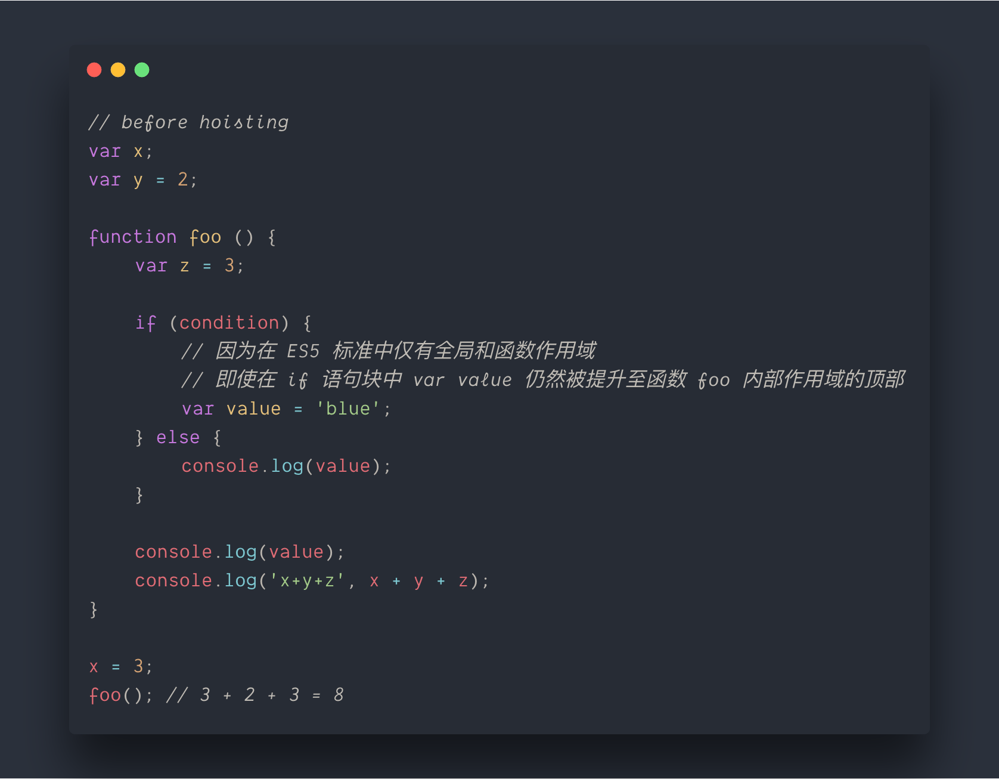
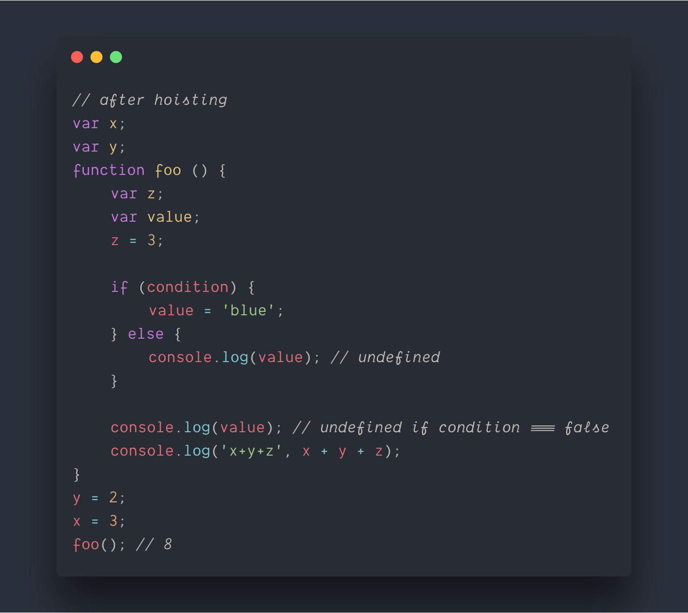
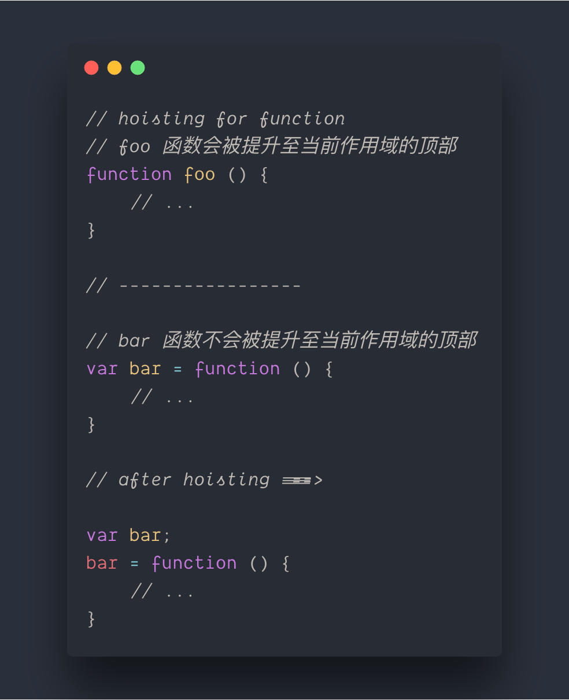
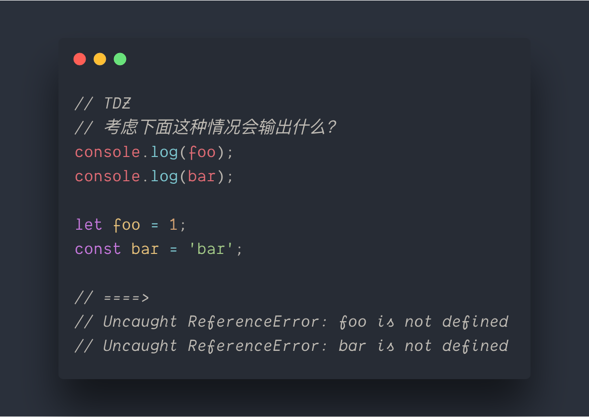
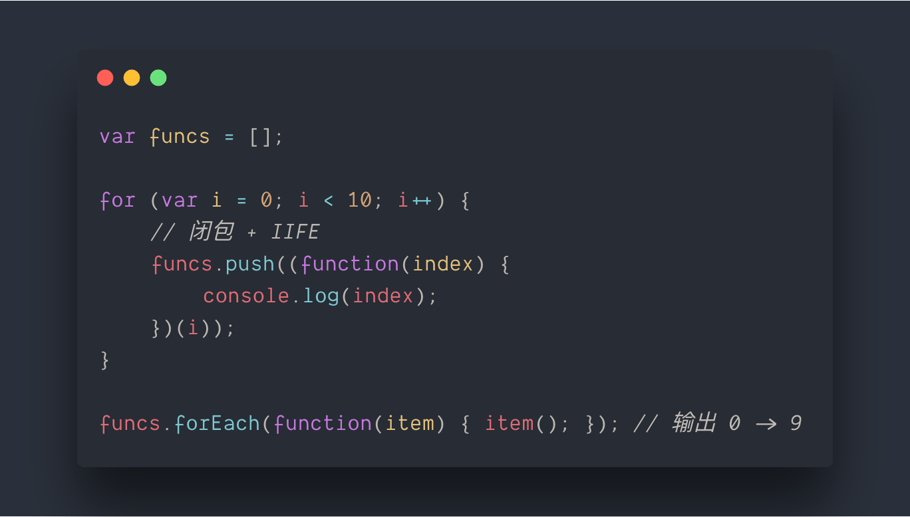
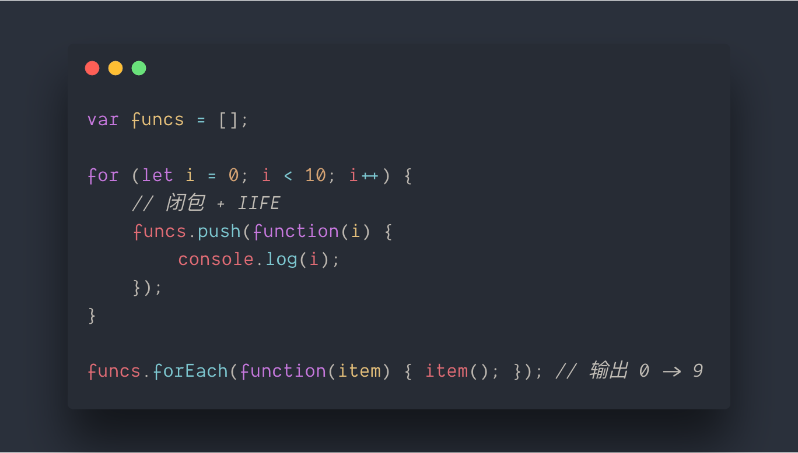
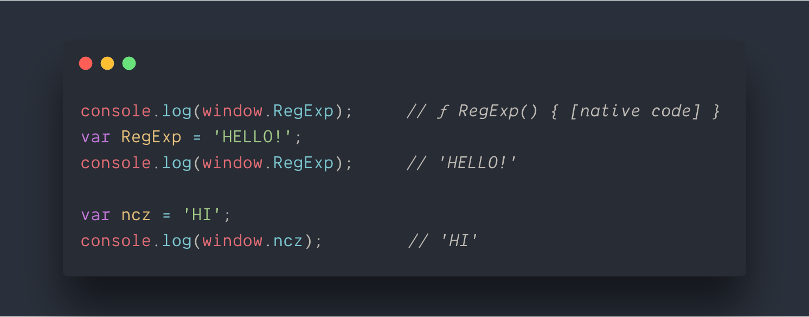
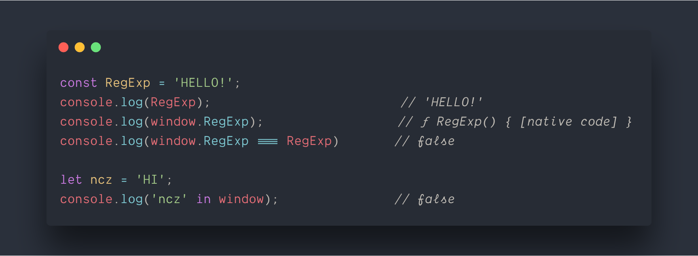

# 第一章 块级作用域绑定

[TOC]

## 变量提升机制 - Hoisting

要理解变量提升首先要明确两个前提：

* 第一个是在 ES5 的世界中，通常使用关键字 `var` 来声明变量；
* 第二个是 javaScript 语言 ES5 的标准下作用域仅仅分为**全局作用域**和**函数作用域（也成为局部作用域）**。

那么变量提升则是在全局或局部作用域内，不论在什么位置通过 var 关键字声明的变量在**解释（编译）阶段**，会提升至当前作用域的顶部。以下面的代码为例：

经过变量提升：

通过以上栗子可以看出，在全局或函数作用域内，变量声明和函数声明均会被提升至当前作用域的顶部，这样解释了为什么先赋值后声明的代码在**运行时**不会报错。需要注意的是，声明函数有两种方式：

* 一种是使用 `function [FunctionName] () {}` 这种方式声明的叫做**函数声明式**；
* 另一种则是使用 `var` 关键字，以 `var [FuncitonName] = function () {}` 的方式创建的叫做**函数表达式**。

*以函数表达式创建的函数并不会被提升至顶部*：

## 块级声明

刚刚接触 JavaScript 的同学对变量提升机制需要适应和习惯，在做项目或者是练习的时候偶尔会出现 bug。为此，ES6 引入了块级作用域来强化变量**生命周期**的控制。

块级作用域用于声明在指定的作用域之外无法被访问的变量。在 ES5 标准时代作用域仅分为全局和局部的，这样导致了在 if 语句块中声名的变量由于被提升至顶部使其可以在作用域内随便被访问（当然，访问的位置要在其声明语句的下方）。这种情况在 ES6 标准中不会发生，因为 if 语句声明的块就是块级作用域。

块级作用域（也叫做词法作用域）存在于：

* 函数内部；
* 块中（字符 `{` 和 `}` 之间的区域，比如 `if / for` 等语句声明的块）。

ES6 标准的目的并非是取替 ES5 标准，它更是一种对于 ES5 各个方面的不足的补全和优化。因此，若想要使用块级作用域，使用 `let` 和 `const` 关键字声明变量（使用 `var` 关键字声明的变量仍然遵从 ES5 标准，块级作用域不会生效）。

### 临时死区 —— TDZ

在学习 `let` 与 `const` 关键字声明的时候，突如其来的一个新概念 —— “临时死区（Temporal Distortion Zone，TDZ）”让我觉得很好奇。

首先，这个名词的来源是 JavaScript 的社区，因为 ES6 标准中没有明确提到 TDZ，但是通常借助它来解释 `let` 和 `const` 不提升的原因。话不多说上代码：

TDZ 通常是指，在同一块级作用域下，使用 let、const 关键字对变量**声明时——静态**对变量进行标记，标记该变量尚在 TDZ 中，在未初始化之前引用该变量会触发**运行时**错误。

### 循环中的函数

在 ES6 之前，如果想要在循环中执行函数并引用每次循环对应的 index 索引需要借助闭包和 IIFE 来实现：

ES6 提出的块级作用域，可以有效的解决这类问题：

let 关键字简化了上述过程，每次循环迭代时都会创建一个新变量 `i`，并以之前迭代中同名变量的值将其初始化。

### 全局作用域绑定

*【ES5】`var` 关键字声明的变量会**创建/覆盖**于全局作用域中:*

从上面代码中可以看出来，`RegExp` 在未声明之前在 window 中是函数，在使用 `var` 关键字声明并初始化为字符串后，window 中 `RegExp` 属性被覆盖了；而且 `ncz` 变量仅仅做了 `var` 的变量声明，但是却被创建在了 window 全局对象中。

*【ES6】使用 let 和 const 关键字声明变量则完全不会出现这种问题：*

在使用 `let` 和 `const` 关键字声明变量时不会覆盖全局对象 window 中已存在的属性，而是会遮盖（此处的“遮盖”的意思是针对全局对象是默认引用的情况）。