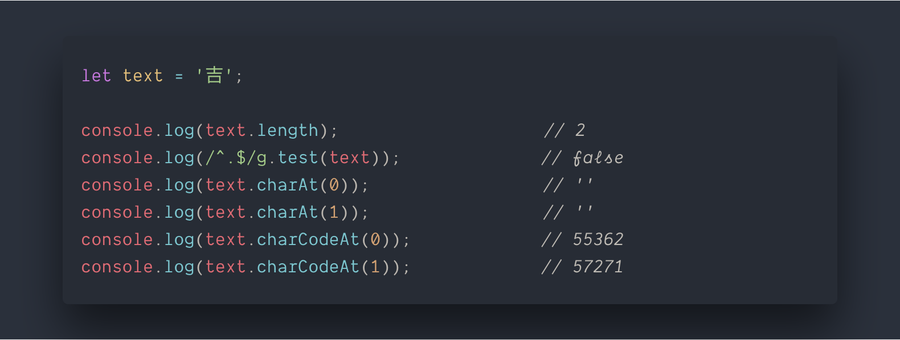
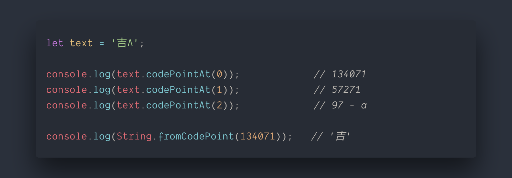
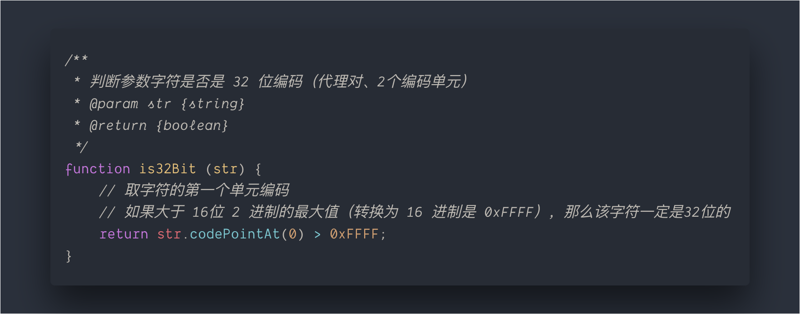
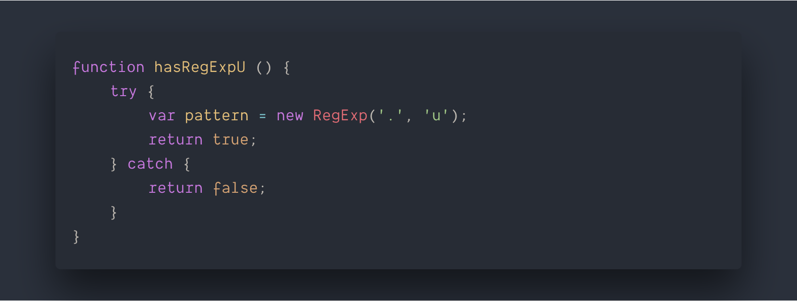
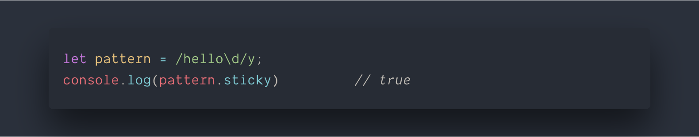
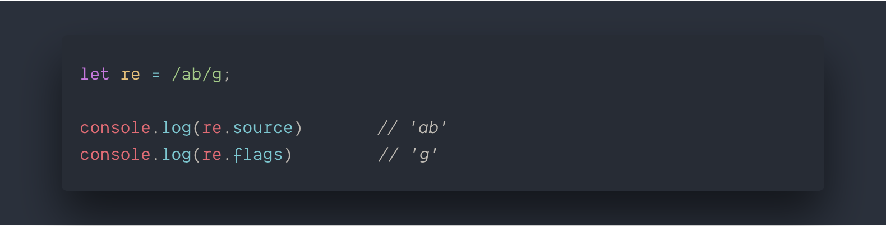
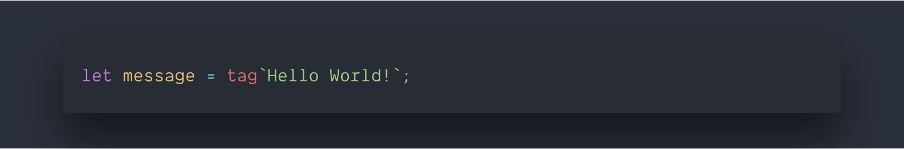
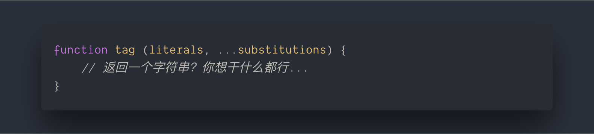
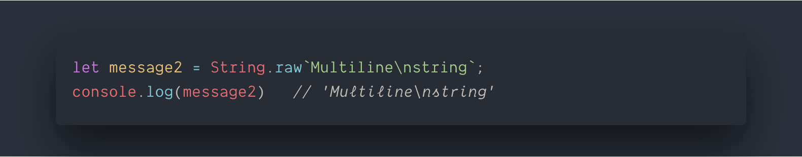

# 第二章 字符串和正则表达式

[TOC]

### 更好的 unicode 的支持

> *在 ES6 出现之前，JavaScript 的字符串一直都是 16 位字符编码进行构建的 —— UTF-16。*

这就会导致一个问题，字符串长度限制在 16 位时不足以表示如此多的字符，因此 UTF-16 引入了代理对，其规定用两个 16 位编码单元表示一个码位（全球唯一的标识符，比如每个汉字）。

字符串的原生处理字符的方法原本是针对一位 16 位编码单元的，那么对于代理对再使用同样的方法得到的结果就会与预期不符。

*以上代码在较新的浏览器中无法复现，是因为现代浏览器已经对 ES6 做了兼容处理了。*

针对上述的问题，ES6 新增了完全支持处理字符串 UTF-16 代理对的方法 —— `codePointAt` 和 `String.fromCodePoint`。

* codePointAt 对应着 charCodeAt，它可以根据字符是由多少个编码单元来确定如何读取相应的字符；
* String.fromCodePoint 对应着 String.fromCharCode，根据指定的码位生成字符（同样兼容了代理对）；

**为了兼容代理对（主要是兼容处理汉字）的情况，建议在以后的开发过程中，使用 `codePointAt` 和 `String.fromCodePoint` 方法来读取字符和生成字符。**

*如何判断一个字符是否是代理对（即 32 为，两个编码单元）？*

### 正则表达式

#### `u` 修饰符

正则表达式是将字符串中每一个字符都以一个 16 位编码单元进行处理。因此对于代理对正则表达式可能会失效。针对这个问题，ES6 提出了一个支持 unicode 的 `u` 修饰符。

检测 u 修饰符的支持情况：

#### `y` 修饰符

y 修饰符也是在 ES6 中被提出，针对正则表达式的一个专有扩展。它会影响正则表达式搜索过程中的 sticky 属性。

其过程是这样的：
> 当在字符串中开始字符匹配时，他会通知搜索从正则表达式的 lastIndex 属性开始进行，如果在指定位置没能成功匹配，则停止继续匹配。

搜索位置必须是从 lastIndex 属性其（作为匹配的开头）。

关于 y 修饰符还需要记住两点：

1. 只有调用 exec 和 test 这些正则表达式对象的方法时才会涉及 lastIndex 属性，这个 y 修饰符才会有效；字符串的 match 无效；
2. 对于粘滞正则表达式而言，如果使用 `^` 字符来匹配字符串开端，只会从字符串的起始位置或多行模式的首行进行匹配。

*检测 y 修饰符是否存在：*

*检测 y 修饰符的支持*

#### flags 属性

ES6 新增了 flags 属性，是获取修饰符的过程变得更加简单，它与 `source` 属性都是只读的原型属性访问器。

访问 flags 属性会返回所有应用于当前正则表达式的修饰字符串。

### 模板字面量

* 是一种 DSL（领域专用语言），不明觉厉；
* 在模板字面量中，不需要转移单、双引号；
* 字符串占位符：将本地变量直接嵌入到输出的字符串中，简化了 ES5 的字符串与变量相加的方式。

#### 标签模板

> 模板字面量真的威力来自于标签模板，每个模板标签都可以执行模板字面量上的转换并且返回最终的字符串值。

调用方式：

*什么是标题模板？*

1. 标签模板可以是一个函数；
2. 第一个参数是数组，包含 JavaScript 解释过后的字面量字符串；
3. 从第二个参数开始，每个参数都是每一个占位符的解释值；

第一个参数虽然是数组，但是却包含一个额外的属性 `raw`，是一个包含每个字面值的原生等价信息的数组。

`String.raw` 是可以访问字符转义被转换成等价字符前的原生字符串;

`raw` 数组中每个字符串与 `String.raw` 执行结果返回的字符串，均是被转义前的原生字符串，所有的字符转义，包括 unicode 码位转义，都会输出他们的原生形式。