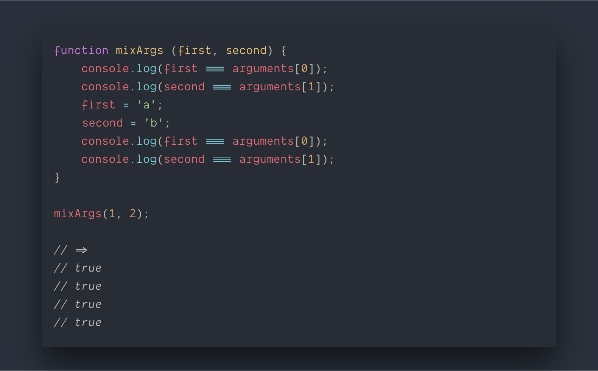

# 第三章 函数

[TOC]

## 函数形参的默认值

只有当参数为 `undefined` 时，才会触发函数参数的默认值行为，若该参数在函数调用过程中，传递 `null` 都会被认为传递了参数；

> 对于默认值来说，`null` 是一个合法值。

### 默认参数对 arguments 的影响

1. 在 ES5 非严格模式下，命名参数的变化会同步更新到 arguments 对象中；

2. 若在 ES5 的严格模式下，不论参数如何变化，均不会对 arguments 对象产生影响；

3. 在 ES6 中，如果函数使用了默认参数，则无论是否是严格模式，行为均与 ES5 严格模式相同；
   

可以看出 `arguments.length = 1`，这是因为函数调用时仅仅传递了一个参数，而 arguments 的存在的意义就是函数运行时。

与之相对的，函数的 length 属性统计的是函数**声明时**的参数的数量，不定参数的加入不会影响 length 属性的值。

### 默认参数表达式

初次解析函数声明时不会调用默认参数表达式，只有在调用该函数时且不传入使用了默认表达式的参数时才会调用。

因为默认参数是在函数调用时才会被引用，因此可以使用先定义的参数作为后定义的参数的默认值。

**需要注意的是，在引用参数（first）默认值的时候，只允许使用前面已经声明过参数作为默认值**，也就是说先定义的参数不能访问后定义的参数；

### 默认参数的临时死区 —— TDZ

块级作用域中存在 TDZ，是因为在使用 let 和 const 关键字声明变量；同样的，函数默认值同样存在临时死区的概念，原理差不多：

ES6 标注下，声明函数时，每个定义的参数都会被创建的标识符绑定（视为被放进了 TDZ），该绑定在参数初始化之前不可被引用，如果在函数调用过程中，先访问了**未被初始化**的参数被抛出错误。

这也是上述 *“先定义的参数不能访问后定义的参数”* 的原因。

### 函数参数有自己独立的作用域和临时死区，其与函数体内的作用域是个各自独立的，就是说参数的默认值不可以访问函数体内的变量；

## 展开运算符

ES5 时代，如果想要将一个数组大蒜后作为各自独立的参数传入函数，是能使用 apply 方法。这种方式需要手动指定 this 的绑定。

ES6 时代，则可以使用展开运算符，且以正常函数调用的方式调用函数即可。

## Name 属性

函数在 ES6 标准都有一个新属性 —— name，解决了匿名函数表达式广泛使用难以追踪的问题。

从上面的代码可以看出：
* 函数表示式 `doSomething` 有一个名字，这个名字比函数本身被赋值的变量的权重高，**函数 name 属性的值不一定引用同名变量**；
* `person.firstName` 实际上是一个 getter 函数，所以它的名字是 `get firstName`，同样的 setter 函数也有前缀 `setter`；
* 类似的，通过 `bind` 函数创建的函数，其 name 中也会有前缀 `bound`，通过 `Function` 构造函数创建的函数，name 中会有 `anonymous` 前缀；

## 明确函数的多重用途

JavaScript 函数有两个不同的内部方法：`[[Call]]` 和 `[[Constructor]]`。

* 当使用 new 关键字调用函数时，执行的是 `[[Constructor]]` 函数，创建一个新对象，执行其函数体，将 this 绑定到实例上，新对象的 `__proto__` 指向 `[[Constructor]]` 的原型对象；
* 如果不通过 new 关键字调用函数，则执行 `[[Call]]` 函数。

*并非所有函数都具有 `[[Constructor]]` 函数，比如箭头函数*。

### 判断函数被调用的方法

在 ES5 中，使用关键字 `instanceof`；

在 ES6 中，使用 new.target 元属性来判断函数是否通过 new 关键字创建的。

当调用函数 `[[Constructor]]` 方法时，`new.target` 被赋值为 new 操作符的目标，如果调用 `[[Call]]` 方法则 `new.target` 的值为 `undefined`;

## 块级函数

ES5 的严格模式下，若在块级作用域中声明函数会抛出错误；

ES6 的标准下，会将函数当做另一个块级作用域，因此在块级作用域中声明函数不会报错，而且可以正常调用；

上述代码中，`console.log(typeof doSomething)` 会打印 `'function'`，说明在 `if` 块级作用域下 doSomething 函数在声明时提升了，但是也仅仅是在当前块级作用域下提升的。

若想要提升到全局作用域的话，使用 var 关键字创建函数表达式：`var doSomething = function () { // ... }`。

若不想进行变量提升的话，请使用 let 和 const 关键字。

## 箭头函数

与传统函数有几点不同：

* 没有 `this / super / arguments / new.target`；
* 不能使用 `new` 关键字创建实例，没有 `[[Constructor]]` 方法；
* 没有原型对象 —— 由于不能使用 `new` 关键字创建实例，因此没有 `prototype` 原型对象；
* 不能改变 `this` 绑定对象；
* 不支持 `arguments` 对象，但是可以访问其外围函数的 `arguments` 对象；
* 不支持重复的命名参数。

*箭头函数也有 name 属性。*

箭头函数虽然不能改变 `this` 绑定，但是同样可以使用 `apply/call/bind` 调用执行。

## 尾调用优化

尾调用的概念：

> 函数作为另一个函数的最后一条语句被调用。

*尾调用优化*

尾调用优化仅在 **ES6 标准下的严格模式** 才会执行，其具有三点原则：

1. 尾调用不访问当前栈帧的变量（不形成闭包）；
2. 函数内部，尾调用是最后一条语句；
3. 尾调用的结果作为函数值返回。

最主要的场景是**递归函数** —— 尾递归。