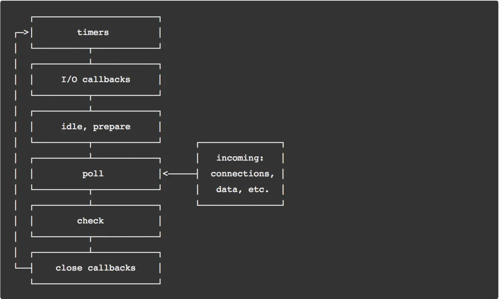

# 《深入浅出 node》读书笔记

## 第一章 node 简介

node 构建的高性能 Web 服务器的特点是：事件驱动、非阻塞 I/O;

node 擅长 I/O 密集型应用的场景，对于 CPU 密集型的应用，如何合理调度是关键；

node 是单线程、单进程的语言，单线程的缺点如下：

1. 无法利用多核 CPU；
2. 错误会引起整个应用退出，应用的健壮性值得考验；
3. 大量计算占用 CPU 导致无法继续调用异步 I/O；

但是 node 也可以使用多线程，借助 `child_process` 模块，与之类似得是在浏览器端的 Web Workers；

## 第二章 模块机制

CommonJS 规范 - 里程碑

请与 CMD 规范区分开；

### 2.1 CommonJS 的模块规范

CommonJS 的模块导出和引入的机制使得用户完全不必考虑变量污染。

#### 1. 模块引用

require 方法引入一个模块的 API 到当前的上下文中；

#### 2. 模块定义

对应引用的功能，上下文提供了 exports 对象用于导出当前模块的方法或变量，并且它是唯一的导出的出口；

在模块中，还存在一个 module 对象，他代表模块自身，而 exports 是 module 的属性；

#### 3. 模块标识

模块标识其实就是传递给 require() 方法的参数，必须符合小驼峰命名的字符串，或者以 `.`、`..` 开头的相对路径或者是绝对路径。

意义在于：将类聚的方法和变量等限定在私有的作用域中，同时支持引入和导出功能以顺畅地链接上下游依赖；

### 2.2 模块的实现

在引入模块的过程中，需要经历如下 3 个步骤：

1. 路径分析；
2. 文件定位；
3. 编译执行；

模块被分为两类：核心模块（node 提供的） 和 文件模块（用户编写的）；

- 核心模块在 node 源码编译时就被编译成了二进制，运行时直接加载于内存中，文件定位和编译执行被省略，且在路径分析中优先判断，因此加载速度是最快的；
- 文件模块则是在**运行时动态加载**，需要完整的路径分析、文件定位和编译执行的过程，速度比核心模块慢；

node 对引入过的模块（编译和执行后的对象）都会进行缓存（`Module._cache`），以减少二次引入时的开销；

无论是核心模块还是文件模块，require() 方法对相同的模块都是**缓存优先的**，这是第一优先级，核心模块的缓存检查会先于文件模块；

在分析路径模块时，require() 方法会将路径转为真实路径，并以真实路径作为索引，将编译执行后的结果放到缓存中，以使二次加载时更快；

#### 1. 路径分析

模块路径：node 在定位文件模块的具体文件时制定的查找策略，具体表现为一个路径组成的数组；

规则如下：

- 当前文件目录下的 node_modules 目录；
- 父目录下的 node_modules 目录；
- 父目录的父目录下的 node_modules 目录；
- 沿路径向上逐级递归，直到根路径下的 node_modules 目录；

#### 2. 文件定位

1. 文件扩展名分析，node 会按照 `.js`、`.json`、`.node` 的次序依次补足扩展名；
2. 目录分析和包，如果文件扩展名分析之后，没有找到文件却得到了目录，会将目录当做**包**处理，查找 `package.json`，基于 `JSON.parse()` 解析出包描述对象，从中取出 main 属性指定的文件名进行定位，若 main 属性指定文件名错误、没有 main 属性、没有 `package.json` 文件，则会将 index 作为默认文件名，依次查找 `index.js/index.node/index.json` 文件；

#### 3. 模块编译

1. `.js`：通过 `fs` 模块同步读取文件后编译执行，对 js 文件进行了头尾包装（这也是为什么在每个 js 文件中都可以使用 `require, module, exports, __filename 和 __dirname 变量`）；

```javascript
(function (exports, require, module, __filename, __dirname) {
  var math = require("math");
  exports.area = function (radius) {
    return Math.PI * radius * radius;
  };
});
```

由于在编译 js 文件时，node 对 js 文件进行了头尾包装，因此不要直接将方法或对象**直接**赋值于 `exports`，这是因为 `exports` 对象是通过形参的方式传入的，直接赋值会改变形参的引用，不会改变被当做参数的原 `exports` 对象（作用域外）；

```javascript
// 错误的赋值
exports = function () {
  // My Class
};
// 正确的赋值
module.exports = function () {
  // My Class
};
```

2. `.node`：这是用 C/C++ 编写的扩展文件，用 `dlopen()` 方法加载最后的编译生成的文件；
3. `.json`：通过 `fs` 模块同步读取文件后用 `JSON.parse()` 解析返回结果；

### 2.3 核心模块

node 的核心模块分为：C/C++ 编写的模块（在 `src` 目录下）和 JavaScript 编写的模块（在 `lib` 目录下）；

**由此，我们在编写 node 模块时也需要将 C/C++ 模块放到 src 文件夹下，将 JavaScript 模块放到 lib 目录下；**

在编译所有 C/C++ 文件之前，编译程序需要将所有的 JavaScript 模块文件编译为 C/C++ 代码（借助 `js2c.py` 工具）；

由纯 C/C++ 编写的部分统一称为**内建模块**，由于一般内建模块不会直接被用户调用，因此未将内建模块算作模块类别之一；

文件模块**依赖**核心模块，核心模块**依赖**内建模块；

JavaScript 核心模块主要有两类职责：

1. C/C++ 内建模块的封装层和桥阶层，供文件模块的引用；
2. 纯粹的功能模块，不需要与底层打交道；

C/C++ 内建模块会根据平台的不同（windows 和 \*nix 平台），对于调用一些底层操作，需要借助 `libuv` 库，这也是 node 可以实现跨平台的诀窍；

## 第三章 异步 I/O

操作系统的内核对于 I/O 只有两种方式：阻塞与非阻塞；

libeio: 采用线程池与阻塞 I/O 模拟异步 I/O，这也是 node 对于异步 I/O 采用的方式；

### 3.3 Node 的异步 I/O

#### 1. 事件循环

进程启动时，node 便会创建一个类似于 `while(true)` 的循环，每执行一次循环体的过程称为 Tick；

node 事件循环一次 Tick 的操作顺序图如下：



由上图可知，node 的事件循环是由各个阶段按照一定顺序循环执行，那么对于 `poll` 阶段来说，是会影响代码里执行顺序的；

其中请注意：

`I/O callback` 阶段是关于 `close callback` / 定时器回调 / `setImmediate` 回调产生异常后调用的回调函数；

而真正的关于 I/O 的回调执行是在 `poll` 阶段，它主要有两个功能：

1. 在 `poll` 队列轮空时，为到达时限的定时器，返回 timer 阶段执行（检查定时器是否到达时限，如果到达时限则回到 timer 阶段执行定时器的回调函数）；
2. 执行 poll 队列中的事件的回调函数；

当事件进入 `poll` 阶段时，并且此时 timer 观察者为空，则：

- 如果存在 setImmediate 也就是 check 观察者不为空，则跳到 check 阶段执行；
- 如果 check 观察者也为空，则事件循环会停留在 `poll` 阶段，等待回调函数添加并执行；

> 此时通常会被问的问题是：setTimeout 和 setImmediate 放在一起谁会先执行？

```javascript
setTimeout(() => {
  console.log("timeout");
}, 0);

setImmediate(() => {
  console.log("immediate");
});
```

答案是不确定，因为在主模块（主程序）中调用，定时器会受到执行过程的约束，因此二者的执行顺序也会不用，有可能会跳到 timer 阶段执行，也有可能会执行 check 阶段；

> 那么如何保证二者执行的顺序一致呢？

将二者放到 I/O 事件的回调中，因为 `setImmediate` 会被放在 check 观察者队列中，在执行 I/O 回调后，由于 check 观察者不为空，因此事件循环会执行下一个阶段 - check 阶段，因此 `setImmediate` 会被先执行（不论 I/O 回调中在 `setImmediate` 前有多少个 `setTimeout`，最先执行的都是 `setImmediate` 的回调）；

```javascript
fs.readFile("test.txt", function (error) {
  setTimeout(function () {
    // -> timer
    console.log("setTimeout");
  }, 0);
  setImmediate(function () {
    // -> check
    console.log("setImmediate");
  });
});

// output:
// setImmediate
// setTimeout
```

事件循环本身是一个典型的「生产者/消费者模型」；

异步 I/O、网络请求等是事件的生产者，将这些不同类型的事件传递给观察者，而事件循环则从观察者那里取出事件并处理；

异步 I/O 事件的底层的非阻塞 I/O 其实是由阻塞 I/O + 线程池模拟的，因此可以看出来，node 的的底层并非是单线程；

事实上，从 JavaScript 发起调用到内核执行完 I/O 操作的过渡过程中，存在一种中间产物，叫做请求对象；

异步 I/O 执行主要被分为两个阶段：**提交请求**和**处理结果**；

异步 I/O 执行的主要流程是：
`文件模块 -> 核心模块 -> 内建模块 -> libnv（桥接层）-> 创建请求对象（保存回调函数、状态和结果） -> 送入线程池 -> CPU 阻塞 I/O 操作、完成 -> 改变请求对象的状态并将结果放入其中 -> 事件循环检测状态（完成） -> 执行回调`；

因此可以推测，异步 I/O 的回调执行有可能与最初的发起事件不在同一个 Tick；

对于 `setTimeout` 和 `process.nextTick` 这种非异步 I/O 来说，不需要系统底层参与，`setTimeout` 和 `setInterval` 属于 timer 观察者，`setImmediate` 属于 check 观察者，**`process.nextTick` 有自己的 nextTick 队列，和微任务相同，在每个事件阶段之后执行，但是执行的时机要早于微任务队列**；

在每一次 Tick 检查中，顺序是 timer 观察者 -> idle 观察者 -> I/O 观察者（这里特指 `poll` 阶段） -> check 观察者；

同时，微任务 + nextTick 队列是以数组的形式存储回调函数的，而 check 观察者是以链表的形式存储的，而处于其中的个体称为「请求对象」（保存回调函数、状态和结果）；

在每次 Tick 的过程中，会保证每次将微任务（包括 nextTick 队列）中的回调函数执行完，而 timer / check / I/O 观察者执行链表中的**一个回调函数**，这么设计的目的在于保证每轮循环能够快速的结束任务，防止 CPU 占用过多而阻塞后续的 I/O 调用的情况；

**node 与浏览器关于事件循环的区别在于：<br />**
node：微任务是在各个阶段之间执行；<br />
浏览器：微任务仅在执行完**一个宏任务**后执行，_主线程也是宏任务_；

## 第四章 异步编程

node 与 浏览器环境均是事件驱动；

### 4.1 函数式编程

> 高阶函数：把函数当做参数或者是将函数作为返回值的函数；

node 事件的处理方式正是基于高阶函数的特性来完成的；

> 偏函数：创建一个调用另外一个部分——参数或者变量已经预置的函数——的函数；

柯里化是典型例子，可以缓存参数；

### 4.2 异步编程的优点

“最大特性莫过于基于事件驱动的非阻塞 I/O 模型”；

不论是计算密集型，还是 I/O 密集型，只要计算不影响的异步 I/O 的调度，那就不构成问题；

建议对 CPU 的耗用不要超过 10 ms，或者将大量的计算分解为诸多的小型计算，通过 setImmediate() 进行调度；

#### 1. 异步编程的难点

1. 异常处理，对异步方法进行 `try/catch` 操作只能捕获当次事件循环（一个 Tick）内的异常；
2. 函数嵌套过深（回到地狱），这是异步编程的典型问题；
3. 阻塞代码；
4. 多线程编程，`child_process` 是基础 API，`cluster` 模块是更深层次的应用；
5. 异步转同步；

### 4.3 异步编程解决方案：

主要解决方案有如下 3 中：

1. 事件发布/订阅模式；
2. Promise / Deffered 模式；
3. 流程控制库；

#### 1. 事件发布/订阅模式

发布/订阅模式本身并无同步和异步调用的问题，但是 node 中，emit() 调用多半是伴随着事件循环而异步触发的，因此事件发布/订阅广泛应用于异步编程；

1. 利用事件队列解决雪崩问题

雪崩问题：高访问量、大并发量的情况下缓存失效的情景，此时大量的请求同时涌入数据库中，数据库无法同时承受如此大的查询请求，进而往前影响到网站整体的响应速度；

利用 events 的 once() 方法请所有的请求的回调压入事件队列中，利用其执行一次就会被监视器移除的特点，保证没一个回调都会被执行一次；

## 第五章 内存控制

node 中通过 JavaScript 使用内存是就会发现只能使用部分内存（64 位系统下约为 1.4GB，而在 32 位系统下约为 0.7GB）；

V8 内存采用分代发，分为老生代和新生代；

老生代内存比较大，用于存放存活时间较长或常驻于内存中的活动对象，在机器为数不同的情况下，老生代在 64 位机器上是 1400MB，在 32 位机器上是 700MB；

新生代内存比较小，用于存放存活时间较短的活动对象，由于 Scavenge 算法，新生代内存由两块 reserved_semispace_size 构成；

V8 内存中允许最多 4 个 reserved_semispace_size 存在，而根据机器位数不同，64 位下每个 reserved_semispace_size 的大小为 16MB，32 位下每个 reserved_semispace_size 的大小为 8 MB；

因此 V8 内存在 64 位机器上最多允许 1464MB，而在 32 为机器上最多允许 732MB；

#### 1. 新生代垃圾回收：Scavenge 算法和 Cheney 算法

Cheney 算法：采用复制的方式实现垃圾回收的算法，将堆内存一分为二，每一部分的空间成为 semispace，这两个空间只有一处处于使用中（成为 from），另一个闲置（称为 to）；

在执行垃圾回收的时候，首先遍历 from 部分，获取到存活的对象移动到 to 的部分，然后将 from 全部释放掉，之后将 from 和 to 的角色互换即可。

Scavenge 算法是典型的的牺牲空间换时间的算法，它的主要原理也说明了为什么两个 reserved_semispace_size 大小必须保持一致，因为需要互换；

当一个对象经过多次复制仍然存活时，他将会认为是生命周期长的对象，会被移动到老生代堆内存中，这种过程称之为晋升，晋升的时机是在新生代内存 from 空间被检查时，晋升的条件是：

1. 经历过一次 Scavenge 回收算法后仍然存活；
2. To 空间的内存占比超过限制（To 空间如果已超过 25% 就直接将其对象晋升）；

#### 2. 老生代垃圾回收：Mark-Sweep 和 Mark-Compact

Mark-Sweep 算法分为 标记（Mark） 和 清除（Sweep）；

Mark-Sweep 算法在标记阶段遍历老生代堆内存中所有对象，标记活着的对象，在随后的清除阶段那种，清除没有被标记的对象；

经过上述的过程可以发现，在一次 Sweep 过程中，没有被标记的对象被清除之后，会在堆内存中产生内存碎片，这些碎片无法被再次分配（因为不连续），因此 Mark-Compact 算法在 Mark-Sweep 基础上演变而来；

Mark-Compact 与 Mark-Sweep 的区别在于，在整理的过程中，标记死亡对象，同时将处于活状态的对象往一端移动，移动完成后，直接清理掉边界外的内存；

老生代的堆内存的垃圾回收算法是 Mark-Sweep 和 Mark-Compact 结合使用，仅有在老生代内存空间不足以对新晋升的对象进行分配时才启动 Mark-Compact 垃圾回收机制；

由于模块的缓存机制，模块是常驻于老生代内存中的；

#### 3. 增长式标记

需要知道的是，为了避免 JavaScript 应用逻辑与垃圾回收器看到的不一致的问题，垃圾回收的 3 种基本算法都需要将应用逻辑暂停，待垃圾回收执行完毕后再恢复执行应用逻辑，这种行为被称为“全停顿”；

那么新生代的 Scavenge 算法由于速度比较快，它的全停顿影响较小，但是老生代通常配置较大、存货对象较多，造成的停顿会比较可怕，因此引入了一个新的算法 —— 「增量标记」；

增量标记的原理就是将全停顿拆分为许多小步，每完成一小步则让 JavaScript 应用逻辑执行一小会儿

V8 后续还引入了延迟清理与增量时整理。

### 5.6 大内存应用

对于操作大文件的场景下，使用 node 的 `stream` 原生模块，直接引入即可；

对于 `fs` 模块可以使用 `createReadStream()` 以及 `createWriteStream()` 方法用于创建文件的可读流和可写流；

这其中需要了解的是两种方法的使用：

```javascript
var fs = require("fs");
var reader = fs.createReadStream("in.txt");
var writer = fs.createWriteStream("out.txt");

// 第一种
reader.on("data", function (stream) {
  writer.write(stream);
});

reader.on("end", function () {
  writer.end();
});

//  第二种方式更方便，可读流提供了 pipe 管道方法，封装了 data 事件和写入操作
reader.pipe(writer);
```

## 理解 Buffer

### 6.1 Buffer 的结构

Buffer 是一个像 Array 的对象，但它主要用于操作字节；

Buffer 是 JavaScript 与 C++ 结合的模块，性能部分由 C++ 实现，非性能相关的部分由 JavaScript 实现；

Buffer 所占用的内存不是通过 V8 分配的，属于堆外内存，C++ 层面实现内存的申请；

由于 Buffer 太过常见，因此 node 在启动时就将它放到了 global 对象上，因此不需要使用 `require()` 即可直接使用；

#### 1. Buffer 对象

Buffer 对象类似于数组，它的元素是 16 进制的两位数，即 0 ~ 255（00 ~ FF）；

Buffer 是伪数组，如果对其下标元素赋值，

- 所赋的值如果小于 0，就需要加上 256 得到 0 至 255 之间的整数
- 所赋的值如果大于 255，就需要减去 256 得到 0 至 255 之间的整数；
- 所赋的值如果为小数，则舍去小数部分，只保留整数部分；

#### 2. Buffer 内存分配

基于 slab 分配机制；

实际上 node 在分配 Buffer 内存时，是以**8K 为界限区分 Buffer 是大对象还是小对象**，这个 8K 的值也就是每个 slab 的大小值；

如果是分配小 Buffer 对象的话，则直接创建一个 slab 单元（8K），内部所有 Buffer 对象在作用域内全部被释放，slab 单元才会被释放；
一个 slab 单元是允许多个 Buffer 对象同时存在的；如果多个 Buffer 对象所需要的内存大于 8K，则才会继续申请一个新的 slab 单元；

如果是分配大 Buffer 对象的话，将会分配一个 slowBuffer 对象作为 slab 单元，同时这个 slab 单元将会被 Buffer 独占；

### 6.2 Buffer 的转换

Buffer 对象可以与字符串之间相互转换；

目前创建 Buffer 对象使用的方法有：

```javascript
Buffer.from(arrayBuffer);
Buffer.from(arrayBuffer[, byteOffset[, length]]);
Buffer.from(buffer);
Buffer.from(object[, offsetOrEncoding[, length]]);
Buffer.from(string[, encoding]);
Buffer.alloc(size[, fill[, encoding]]);
Buffer.allocUnsafe(size);

// Buffer.alloc(size, fill) 永远不会使用内部的 Buffer 池
// 而 Buffer.allocUnsafe(size).fill(fill) 在 size 小于或等于 Buffer.poolSize 的一半时将会使用内部的 Buffer池。
```

在最新的 node 中，本书中部分 api 参数为 start 和 end 表示起始与终点，被更新为 offset 和 length，即起点与长度；

#### 1. 字符串互转 Buffer

字符串 -> Buffer：主要是通过构造函数来完成的

```javascript
new Buffer(str, [encoding]);
```

Buffer -> 字符串：通过 Buffer 对象的 toString() 可以将 Buffer 对象转换为字符串；

```javascript
buf.toString([encoding], [start], [end]);
```

Buffer 不支持的编码类型包括了中国常用的 GBK、GB2313 和 BIG-5 编码；

`fs.createReadStream` 方法中第二参数是配置，可以指定读取文件时 Buffer 的分配，`{ highWaterMark: [number] }`，`highWaterMark` 的值越大，读取的速度就越快；

## 第七章 网络编程

TCP 称为传输控制协议；<br />
UDP 称为用户数据包协议；<br />
HTTP 称为超文本传输协议；

UDP 与 TCP 最大的区别是，UDP 是面向无连接的，因此用于音频、视频传输；<br />
HTTP 是基于 TCP 会话，但本身并无会话的特点，同时具有无状态的特点；

#### 1. HTTP

HTTP 分为请求 request 和 response；

请求具有三层结构：请求行、请求头和请求体；

1. 请求行：请求方法 method，地址 url，请求版本 httpVersion;
2. 请求头：`key: value` 的格式；
3. 请求体：只读流对象；

响应同样具有三层结构：响应行、响应头和响应体；

#### 2. WebSocket

在 WebSocket 出现之前，客户端与服务端进行类似于长连接这种通信的方式主要借助 Comet 技术；

所谓 Comet 技术的细节就是采用长轮询或者是 iframe 流；

**长轮询**的原理就是：

客户端向服务端发起请求，服务端收到请求后不会立即返回数据，而是将请求挂起，比对需要返回的数据是否有更新，如果有更新则响应请求返回数据，如果没有更新则会被一直挂起至一定的时间后再返回；

而客户端在收到服务端的数据后进行处理，只有在处理完服务器返回的数据后，再次发送请求，建立连接；

这种好处在于，借助服务端对请求的挂起，起到了一定的延长请求时间的作用，减少了很多不必要的请求次数，但是同样的，请求挂起也会浪费资源；

#### 3. HTTPS

HTTPS 服务就是工作在 TLS/SSL 上的 HTTP；

TLS/SSL 是一个公钥/私钥的结构，它是一个非对称的加密结构；
当服务端发送数据给客户端时，服务端会用客户端的公钥加密，传输到客户端后，客户端用客户端私钥解密；
当客户端发送数据给服务端时，客户端会用服务端的公钥加密，传输到服务端后，服务端用服务端私钥解密；

TLS/SSL 还引入了数字证书 CA 来进行认证（应对中间人攻击）；

## 第八章 构建 Web 应用

#### 1. Cookie

Cookie 的处理分如下几步：

1. 服务端向客户端发送 cookie；
2. 浏览器将 cookie 保存；
3. 之后每次浏览器都会将 cookie 发向服务端；

Cookie 中的 httpOnly 选项会告知浏览器不允许通过脚本 `document.cookie` 修改这个 cookie 的值，实际上设置了 httpOnly 之后，这个 cookie 在 `document.cookie` 中是不可见的；

为静态组件使用不同的域名，一旦 cookie 过多会导致请求头较大，而且大多数的 Cookie 并不是每次都需要的，因此对于静态组件使用不用的域名可以起到一定的优化作用；

这是因为静态组件（文件）来说，其所涉及到的业务定位几乎不关心状态，而且**由于域名不同，还可以突破浏览器下载线程数的限制**；

#### 2. Session

Session 的数据仅保留在服务器端，客户端无法修改；

Session 的有效期通常较短，普遍设置的是 20 分钟，如果 20 分钟之内客户端与服务端没有交互的话，服务端就会将 session 数据删除；

#### 3. Basic 认证

Basic 认证是当客户端与服务端进行请求时，允许通过用户名和密码实现的一种身份认证方式；

如果有一个页面需要 basic 认证，它会检查请求报文头中的 Authorization 字段的内容；

同时，在 Basic 认证中，它会将用户名和密码组合，以 `username + ':' + password` 的形式进行 base64 编码；

## 第九章 玩转进程

#### 1. 创建子进程

`child_process` 模块给予 node 可以创建子进程的能力，它提供了 4 个方法用于创建子进程；

- `spawn()`：启动一个子进程来执行命令；
- `exec()`：启动一个子进程来执行命令，与 `spawn()` 不同的是器接口不同，他有一个回调函数获取子进程的状况；
- `execFile()`：启动一个子进程来执行可执行文件，如果是 js 文件的话，需要在文件首行加上 `#!/usr/bin/env node`；
- `fork()`：与 `spawn()` 命令类似，不同点在于它创建的 node 子进程只需指定要执行的 js 文件模块即可；

鲜活的例子：

```javascript
var cp = require("child_process");
cp.spawn("node", ["worker.js"]);
cp.exec("node worker.js", function (err, stdout, stderr) {
  // some code
});
cp.execFile("worker.js", function (err, stdout, stderr) {
  // some code
});
cp.fork("./worker.js");
```

#### 2. 进程间通信

浏览器端的 Web Worker：主线程与工作线程之间通过 `onmessage()` 和 `postMessage()` 进行通信；

node 端则是子进程对象通过 `send()` 方法向主进程发送数据，`message` **事件**实现收听子进程发来的数据；

```javascript
// parent.js
var cp = require("child_process");
var n = cp.fork(__dirname + "/sub.js");

// 使用子进程 n 向子进程发送数据，而不是 proces 主进程
n.on("message", function (m) {
  console.log("PARENT got message:", m);
});

n.send({ hello: "world" });

// sub.js
// 在子进程中，process 指向当前的子进程
process.on("message", function (m) {
  console.log("CHILD got message:", m);
});

process.send({ foo: "bar" });
```

### 9.4 Cluster 模块

若要创建单机 node 集群，可以使用 cluster 模块，以解决多核 CPU 的利用率问题，同时也提供了较完善的 API，用以处理进程的健壮性的问题；

具体如何使用，本书中并未具体指出，待用时再补充；

## 第十章 测试

测试风格：现今流行的测试风格主要有 TDD （测试驱动开发）和 BDD （行为驱动开发）两种，二者差别如下：

1. 关注点不同，TDD 关注的是功能是否被正确实现，每一个功能都具备对应的测试用例；BDD 关注整体行为是否符合预期；
2. 表达方式不同。TDD 的表述偏向于功能说明书的风格；BDD 的表述方式更接近自然语言的习惯；

TDD 主要采用 describe 和 it 进行阻止；
BDD 主要采用 suite 和 test 完成测试用例的编写；

## 总结

到此，《深入浅出 node》这本书正式读完，大概用了一周时间，细度一遍、通读一遍，其中还是发现了不少第一遍读时所记录的笔记上的错误，整本书偏向于概念和原理，对于 node 的 API 介绍的比较少，但是仍然从中学习到了很多有用的原理性知识。
